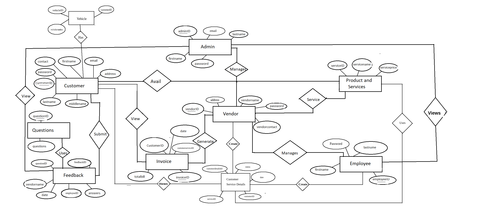

## CDAC Project

---
## Garage Management System Project
---

###  Scope Of Project 

* Currently vehicle servicing management has become a tedious job. 
* Small and medium scale garage, service centers have to manage data about customers, services offered to them. 
* It is difficult for small scale businesses to maintain data for longer time as they are using paper based system. 
* Customers also need to find nearest garage which provide authentic service. 
* Using this system they will be able to maintain customer and services data. 
* Also multiple services centers which are using the same system will be able to synchronize their work. 
* We are also solving the problem from customer's end by making ease of choice.They can choose the service center nearby their location.

---

### Application Panel/Front :- 

1. **ADMIN**

  - Signup
  - Signin
  * Vendor Management
      - List all vendors
      - Add vendor
      - delete vendor
      - update vendor
      - block vendor
      - unblock vendor
  * Analytics
      - vender report per vendor
      - overall report generation
  * Offer Management
      - create an offer
      - get all offers
      - update an offer
      - delete an offer 
      


2. **VENDOR**

 - Signin
 * Employee Management
     - list employee
         + single employee
         + all employees
     - add employee
     - update employee
     - delete employee
 * Customer Management
     - get customer
         + single customer
         + all customers
     - add customer
     - update customer
         + block customer
         + unblock customer
     - delete customer
 * Service Management
     - get all job cards
     - delete job card
     - generate invoice/bill
 * Analytics
     - employee performence
     - daily servicing report
     - monthly servicing report
 * Feedback
     - list feedback
     - delete feedback   

---

3. **EMPLOYEES**

 - Signin
 * Job card management
     - view job cards for th employee
     - make a job card
         + servicing details
     - update job card
     - delete job card
 * Feedback
     - get feedback        
 
---

4. **CUSTOMER**

 * Signup
 * Signin
 * Service Management
     - get service history
     - get current service details
     - get invoice
     - Pay Bill
 * Feedback
     - add feedback
     - delete feedback that has already been posted

---


## UML CASE DIAGRAM FOR GARAGE MANAGEMENT PROJECT 

---
- Customer: Client, who gets service by vendor.
- Vendor:   Service center owner.
- Employee: He actually handles service of customers.
- Admin:   He has an authority to ADD and DELETE Vendors.
---

### Customer role:   
   
1. 	Login
2. 	Register
3. 	Vehicle Servicing Task
4. 	Service History
5. 	Service Booking
6. 	View  Invoice Details
7.  Pay Bill
8. 	Feedback

  ```plantuml 
left to right direction
Customer-->(login)
Customer-->(Register)
Customer-->(Servicing History)
Customer-->(Service Booking)
Customer-->(Inform Servicing Task)
Customer-->(View Invoice Details)
Customer-->(Pay Bill)
Customer-->(Feedback)

```


### Vendor role:

1.  Login
2.  New customer registration
3.  Remove Customer
4.  Search Existing customer 
5.  Employee Management
	- Add Employee
	- Remove Employee
	- List Registered Employee
6.  Job Assignment to Employee
7.  Generate Service Invoice/ Bill
8.  Report generation
	- Employee performance
	- Daily/Monthly servicing report
9.  Store Management
	- Add Part entry
	- Remove Parts
	- List available parts
10. Inform customer about servicing status/Servicing Status
11. Servicing Task
12. Create Check-list/JobCard
13. Feedback


 ```plantuml 
left to right direction
vendor-->(login)
vendor-->(New customer Registration)
vendor-->(Remove Customer)
vendor-->(Search Existing Customer )
vendor-->(Employee Management )
vendor-->(Job Assignment to Employee)
vendor-->(Generate Service Invoice/ Bill)
vendor-->(Report generation)
vendor--> (Store Management)
vendor-->(Inform customer about servicing status/Servicing Status)
vendor-->(Servicing Task)
vendor-->(Create Check-list/JobCard)
vendor-->( Feedback)
```

### Employee role:

1. Register
2. Login 
   - Update info
3. Job Card updation
   - Create Job-card
   - Update Job-card/ Select Additional Task Performed on vehicle
   - View Job-card
4. Request to Generate Estimated Bill
5. Feedback
         
 ```plantuml 
left to right direction
Employee-->(Register)
Employee-->(login)
Employee-->(Job Card updation)
Employee-->(Request to Generate Estimated Bill)
Employee-->(Feedback)
```

### Admin role:

1. Login
2. Vendor Management
   - Add Vendor
   - Remove Vendor
   - List  and search Registered Vendor
3. Employee Management
4. Offers on servicing
5. Vendor Report per vendor
6. Overall  Report Generation
            
 ```plantuml 
left to right direction
Admin-->(login)
Admin-->(Vendor Management)
Admin-->(Employee Management)
Admin-->(Offers on servicing)
Admin-->( Vendor Report per vendor)
Admin-->( Overall  Report Generation)
```

---

## E-R Diagram

---


---


